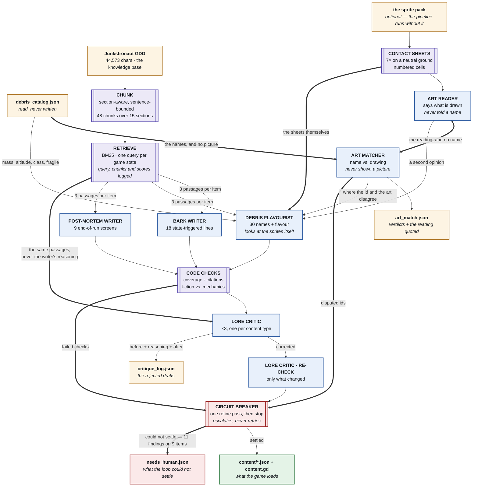

# The content pipeline, in one picture

## What is a model and what is not

Everything in purple is code with no model in it: the chunker, the retriever, the contact-sheet
renderer, the coverage and citation checks, the fiction-versus-mechanics check, and the decision to
apply a correction. Everything in blue is an agent. Nothing crosses.

That line is where the pipeline's claims come from. "Retrieval is accurate" is a number computed
against labels written before either retriever ran. "The fiction matches the mechanics" is a
comparison of two files. "The critic caught a lore break" is an agent's judgement — and it is the
only one of the three that is, which is why the report prints the passage the critic cited next to
the line it rejected.

## Why the breaker does not loop

The refine loop is one pass — write, judge, correct, re-judge — and the red box is where it stops
rather than going round again. That bound is a decision, not a shortcut. By the time an item has
been rewritten by its own critic and still fails, one of three things is true, and a second pass
fixes none of them:

- **the data is wrong** — `torn_foil_blanket` is flagged fragile in the catalogue and its sprite is
  a cracked steel plate. The writer described the plate, correctly, and could not honestly claim
  fragile. Retrying can only make it lie.
- **the critic is wrong** — a non-passing verdict carrying no usable correction is a finding about
  the judge.
- **the item is genuinely hard** — and the same prompt over the same passages a third time is the
  textbook definition of a loop that has stopped making progress.

So the breaker collects, names, and hands over: `out/checks/needs_human.json`, every finding with
the reason it was not retried. It changes no content — the flagged lines still ship, because
somebody reviewing a flagged line needs to read it in place. `--strict` turns a tripped breaker into
exit 3 for a build step that must not wire unread content into the game.

## Who is allowed to see what

Three agents touch the art and they are not given the same things, on purpose.

| | sees the sprites | sees the names | why |
|---|---|---|---|
| **art reader** | **yes** | no | a reader told the name confirms the name |
| **art matcher** | no | **yes** | a judge shown the picture re-decides what it depicts, then agrees with itself |
| **debris flavourist** | **yes** | **yes** | it is the writer, not a judge — it needs everything |

The flavourist is the one agent allowed both, and that is not an inconsistency: it is not judging
anything. It writes the words a player reads *while looking at the sprite*, so it had better be
looking at the sprite. It used to work from the reader's paraphrase instead, which is a game of
telephone — the reader saw "a chipped notch out of the upper right edge and a fracture across the
face", and the writer one hop downstream produced "cracked end to end". The specific detail that
makes a piece recognisable on screen is precisely what a paraphrase drops.

The reader's words are still passed along as a second opinion, and they are the only art input
when a run has no sprites on disk.

## The three heavy edges

All three are the same idea: **a judge is worth having only if it cannot be told the answer first.**

`RET ==> LC` — the lore critic is given the retrieved passages and the generated items, and **not**
the writer's `why` field. `run-content.js` strips it before the call. A critic that reads the
writer's justification is a critic being argued with: a confident sentence about why a line is fine
talks it into agreeing with a passage that says otherwise. This is the same discipline the tuning
crew's Spec Auditor runs on, copied here deliberately.

`AR ==> AM` and `CAT ==> AM` are the same seam drawn across the art stage. The reader is shown
pictures and no names; the matcher is shown names and no pictures. Neither can quietly re-decide
the other's half. One agent given both would read the picture through the name and confirm
whatever it was told — which is exactly the failure the stage exists to catch, since the
name-to-sprite mapping was made by eye and never verified.

Two tests hold that seam open: one asserts the reader's prompt contains no piece name, the other
that the matcher's prompt contains no image path. Without them the property is one prompt edit away
from disappearing without a sound.

## The art stage is optional, on purpose

The sprite pack is licensed for use and not for redistribution, so a published copy of this project
has no art in it. Every other stage keeps working: the sheet layout is computed from the catalogue
rather than from the files on disk, so a replay reproduces the same cell numbering on a machine
with no sprites at all, and the readings come back out of the recorded envelopes.

What cannot ship is `out/report/art.html`, which embeds the sprites. The findings live in
`out/art/art_reading.json` and `out/art/art_match.json` — same evidence, no pixels.
